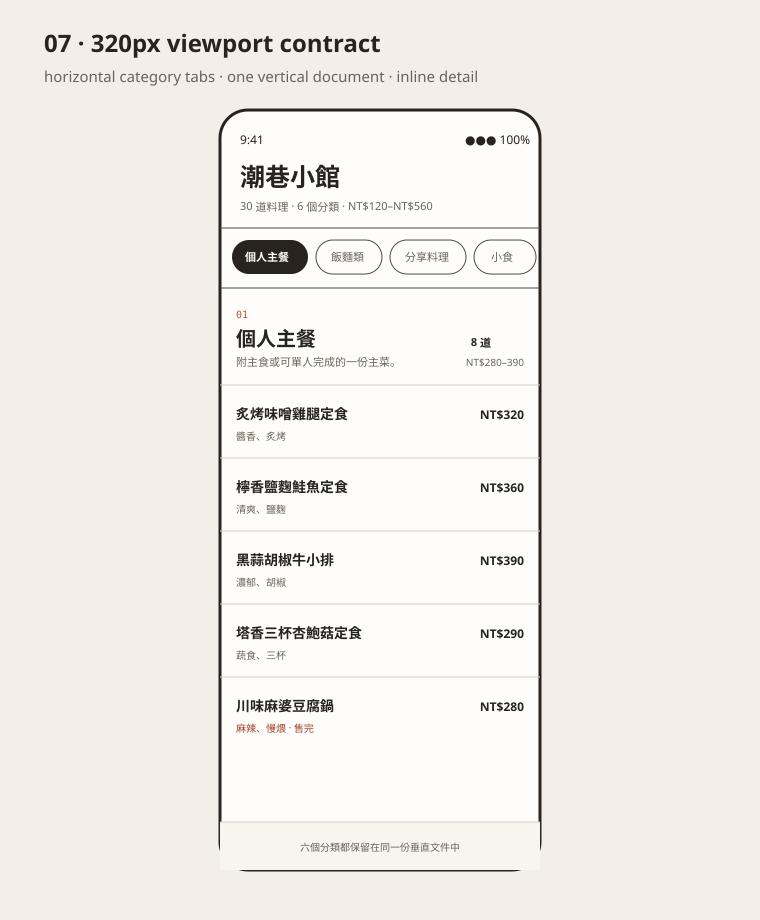
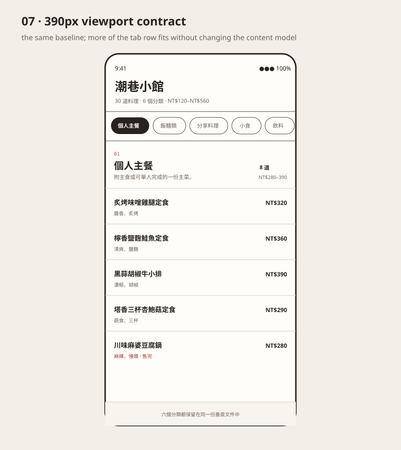
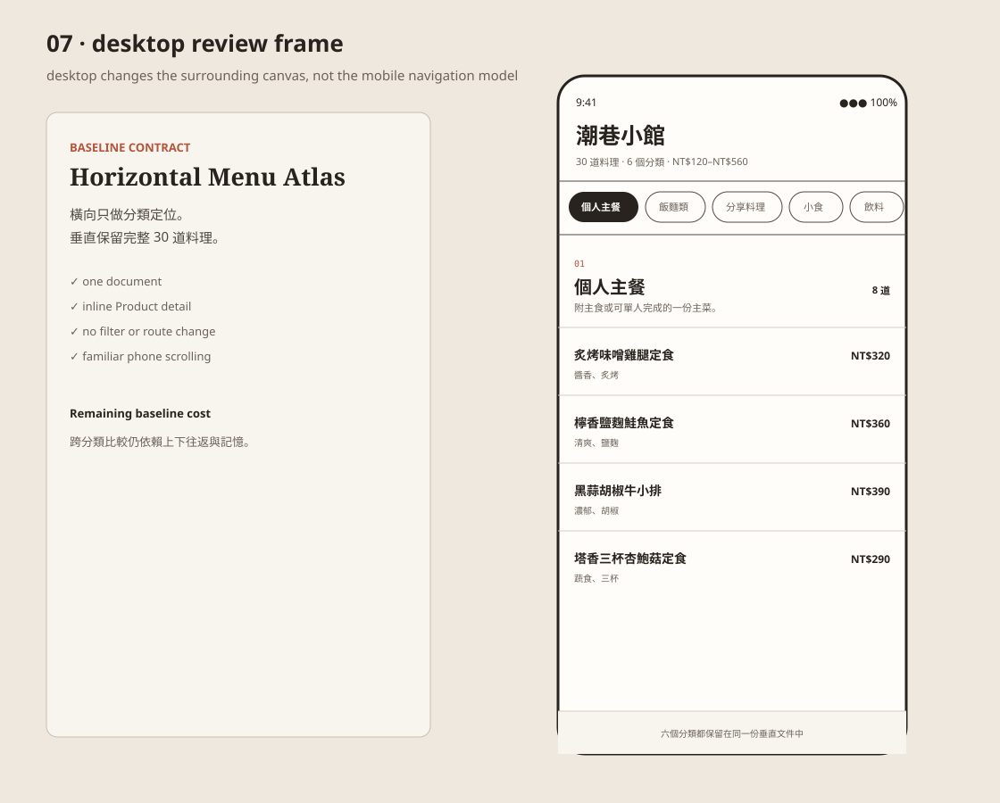

# 07 Horizontal Menu Atlas baseline reconstruction review

```text
Repository: a20030824/menu-lens
Branch: agent/menu-lens-07-baseline-reconstruction
Base main: 54bde49c6c1df800ba2e8d1b014c2a2b9eef9177
Object: 07 Horizontal Menu Atlas
Classification: executable market baseline
```

## Why reconstruct 07 now

07 previously existed only as a written market reference:

- horizontal category navigation;
- vertical Product lists inside each category;
- no executable path in the prototype registry.

That was enough while the project was generating spatial hypotheses. It became insufficient once 08A, 09A, and 10A were reviewed as bounded repairs, because the familiar control case still could not be opened with the same six-category / 30-Product fixture.

This branch makes 07 executable without turning it into another hypothesis.

## Baseline contract

07 reconstructs the familiar pattern as one continuous document:

```text
horizontal axis = category tabs only
vertical axis = complete menu content
inline depth = Product details
```

The category tabs do not:

- filter Products;
- replace the current page;
- reorder categories;
- create a second content surface;
- compress the complete menu;
- move a camera or reading lens.

Each tab only scrolls the same vertical document to the corresponding category section.

## Fixture truth

The reconstruction uses `menu-fixture.js` directly and renders:

- six categories in canonical order;
- 30 unique Products in canonical order;
- one category tab for each category;
- category name, description, count, and fixture-backed price range;
- Product name, cue, price, availability, description, portion, preparation rhythm, and required configuration.

No Product is filtered out when a category tab becomes active. Sold-out Products remain visible and truthful.

## Interaction model

### Category navigation

- The tab row scrolls horizontally when the six labels do not fit.
- Selecting a tab scrolls the single menu document to that category.
- Scrolling the document updates `aria-current` on the nearest category tab.
- The active tab is brought into the visible part of the tab row.
- Reduced motion changes smooth movement to immediate movement.

### Product details

- Native `details` / `summary` supplies inline Product expansion.
- Opening one Product closes any other open Product.
- Escape closes the open detail and restores focus to the same summary.
- Detail expansion does not reorder or remove other Products.

## What this baseline is good at

- The model is familiar and requires little explanation.
- Product names and prices are directly readable.
- Category tabs provide a predictable shortcut into a long document.
- Native vertical scrolling matches common phone behavior.
- Inline detail preserves context and has a straightforward keyboard model.
- The complete menu remains auditable in one document.

## What this baseline does not solve

- Categories outside the viewport have no visible content landmark.
- Cross-category comparison still requires vertical movement and memory.
- The tab row exposes category names, not the complete menu distribution.
- Selecting a category does not preserve simultaneous awareness of all six category bodies.
- Long-document cost remains proportional to content length.

These are baseline limits, not implementation defects to repair inside 07.

## Relation to 08–10

| Object | Additional mechanism beyond 07 | Question it asks |
| --- | --- | --- |
| 08 Menu Spread | six category regions remain simultaneously present and one expands in place | Does persistent category position justify compressed siblings and horizontal spread movement? |
| 09 Horizontal Ribbon | all 30 Products share one long horizontal coordinate | Does canonical X position justify long-distance horizontal travel? |
| 10 Fisheye Ribbon | all 30 Products remain in one viewport with local width deformation | Does local magnification justify distorted Product position and unreadable far labels? |

07 supplies the familiar control case for those questions. It is not their ancestor in the sense of shared implementation code; it is their market baseline in the research family.

## Viewport evidence

The committed assets are geometry/content captures rather than live browser screenshots. They show the same baseline at required review widths.

### 320px



### 390px



### Desktop phone frame



The phone-frame width changes, but the model remains the same: horizontally scrollable tabs above one vertically scrollable document.

## State assessment

| State | Result |
| --- | --- |
| initial | First category tab is current; all 30 Products remain in the document. |
| category tab | Same document scrolls to the selected category; no filtering or route change. |
| manual vertical scroll | Current category tab follows the nearest section. |
| tab-row overflow | Native horizontal tab scrolling; content does not move horizontally. |
| detail open | One Product expands inline; every other Product remains present. |
| detail close | Escape closes the detail and returns focus to its summary. |
| reduced motion | Category and tab reveal movement become immediate. |
| small viewport | Tab labels may overflow horizontally; Product rows remain full-width and readable. |

## Files changed

```text
docs/research-history/07-horizontal-menu-atlas-review.md
package.json
research-history/horizontal-menu-atlas.css
research-history/horizontal-menu-atlas-renderer.js
research-history/index.html
research-history/phases/07-horizontal-menu-atlas/index.html
research-history/prototype-registry.js
research-history/review-assets/07/*
scripts/validate-07-horizontal-menu-atlas.mjs
```

Shared Product data changed: none.

Shared spatial runtime files changed: none.

## Automated validation

The 07-specific validator checks:

- registry identity, family, root lineage, status, path, profile, and exact assets;
- six category sections and six category tabs in canonical order;
- 30 unique Products in canonical order;
- one navigation surface and one vertical document surface;
- fixture-backed renderer use;
- category click, scroll-following active state, inline detail, Escape focus restoration, and reduced motion contracts;
- absence of minimap, fisheye, camera, Candidate, cart, order, spatial drag, scroll snap, transforms, or horizontal Product tracks.

## Final disposition

**REFERENCE — executable baseline.**

07 is now complete enough to serve as the familiar control case for 08–10. It should not receive an A/B rescue branch because its unresolved costs are the reason the spatial prototypes exist. Adding overview maps, compressed category bodies, direct ribbon position, or a lens would stop being 07 and duplicate those later objects.
