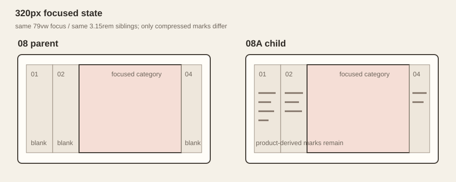
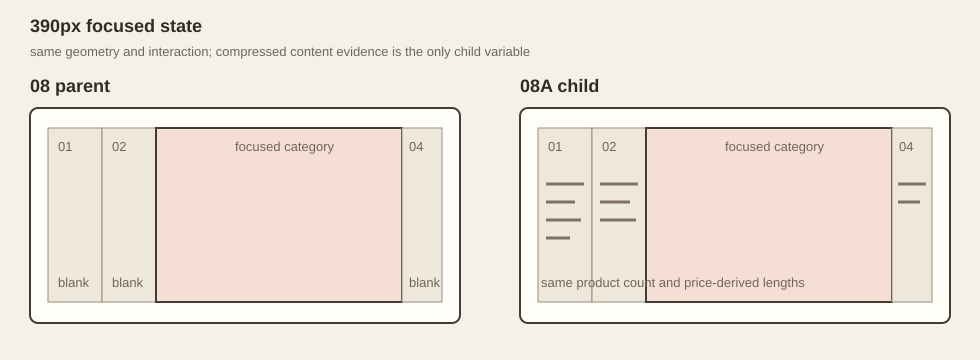
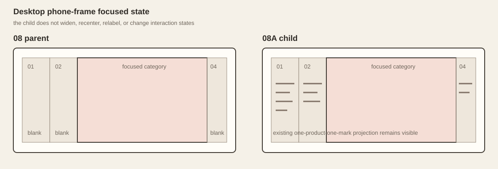

# 08A Compressed Truth Cue implementation review

```text
Repository: a20030824/menu-lens
Branch: agent/menu-lens-08a-compressed-truth-cue
Base main: 54bde49c6c1df800ba2e8d1b014c2a2b9eef9177
Parent: 08 Menu Spread
Child: 08A Compressed Truth Cue
```

## Re-read finding

The first description of the problem was too broad. Parent 08 already contains several truthful compressed-category signals:

- category name;
- exact product count;
- fixture-backed category price range;
- one renderer mark per real Product;
- mark length derived from the Product price.

The actual loss occurs only after entering category focus. Parent CSS applies:

```css
.spread-map[data-mode="focus"] .spread-category__marks { display: none; }
```

Every compressed sibling therefore keeps its title, count, and price range but loses the product-density and price-distribution marks that were visible in overview.

## Unique variable

08A changes only that visibility rule.

```text
08 parent focused state:
compressed sibling marks = hidden

08A focused state:
compressed sibling marks = visible
focused category marks = hidden
```

The child does not generate new metadata or a new diagram. It reveals the exact marks already produced by the shared parent renderer.

## Truth contract

The shared renderer produces:

- exactly one `.spread-category__marks` group for each of the six categories;
- exactly one mark for each of the 30 Products;
- each mark width from the existing `product.price` projection;
- category count and price range from the same fixture.

The marks remain `aria-hidden` because the category button already exposes readable category name, count, and range. They are a visual density and distribution cue, not a replacement accessible name.

## Parent behavior preserved

The child copies the exact parent inline interaction controller. Automated validation compares the complete controller source and rejects any drift.

Preserved behavior includes:

- six fixed category positions;
- overview state;
- `3.15rem` compressed category width;
- `min(79vw, 21rem)` focused category width;
- horizontal overflow only in focus mode;
- proximity scroll snap;
- category click to focus and click-again return;
- previous and next category controls;
- ArrowLeft and ArrowRight category focus;
- horizontal drag and nearest-category settle;
- native inline Product details;
- one open detail inside the focused category;
- Escape closes detail first, then returns to overview;
- focus restoration to the source category control;
- reduced-motion scroll behavior and transition removal.

## Viewport evidence

The evidence assets are geometry/cue captures rather than live browser screenshots. They show the same parent and child category widths, with only compressed mark visibility changed.

### 320px



### 390px



### Desktop phone frame



The child adds no breakpoint. At all widths the cue uses the remaining vertical body of each existing compressed column.

## State assessment

| State | Result |
| --- | --- |
| overview | Identical to parent 08; marks were already visible. |
| category focus | Focused category remains unchanged; compressed siblings retain the existing marks. |
| previous / next | Exact parent controller; only the selected category changes. |
| drag settle | Exact parent controller and shared `spatial-drag.js`. |
| detail open | Marks remain only in compressed siblings; focused Product list and detail are unchanged. |
| detail close | Escape and focus return are unchanged. |
| reset | Exact parent return-to-overview path; all six categories return to equal columns. |
| reduced motion | Parent behavior is inherited; child CSS adds no transition. |

## Expected benefit

The compressed siblings should read less like empty tabs because they continue to show that real menu content remains behind each narrow category. Product count is visible as both text and mark density, while relative price distribution remains visible as mark length.

The cue does not make far Product names readable. It only preserves truthful evidence that the category is still a populated region of the same menu.

## Possible cost

The narrow siblings may become visually noisy, especially for the eight-Product category at 320px. The implementation deliberately does not add a legend, color encoding, hover explanation, extra control, or adaptive simplification. If the marks do not improve spatial continuity, the correct result is to stop and retain parent 08.

## Files changed

```text
research-history/phases/08a-compressed-truth-cue/index.html
research-history/compressed-truth-cue.css
research-history/prototype-registry.js
research-history/index.html
scripts/validate-08a-compressed-truth-cue.mjs
package.json
docs/research-history/08a-compressed-truth-cue-review.md
research-history/review-assets/08a/*
```

Shared runtime files changed: none.

Archive integration files changed:

- `research-history/prototype-registry.js`;
- `research-history/index.html`;
- `package.json`.

Parent 08 HTML, CSS, renderer, shared fixture, and shared drag controller remain unchanged.

## Automated validation

The child-specific validator checks:

- registry lineage, path, profile, and exact asset list;
- exact equality of the parent and child inline controllers;
- parent still owns the original hide rule;
- child reveals marks only in non-focused compressed siblings;
- focused category marks remain hidden;
- no geometry, camera, typography, scrolling, or transform property is introduced by child CSS;
- six cue groups and 30 Product-derived marks still come from the shared renderer;
- mark length remains tied to the existing price projection;
- no order action is introduced.

## Initial implementation judgment

**Directionally coherent; final KEEP or UNSUCCESSFUL judgment should be based on whether the retained marks improve compressed-category continuity more than they add noise.**

No second mechanism will be added to rescue the cue. The next review should inspect only the existing 320px, 390px, and desktop focused states plus keyboard, Escape, reset, and reduced motion.
