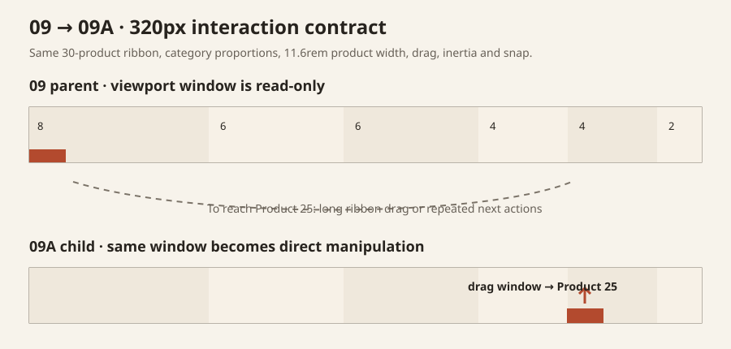
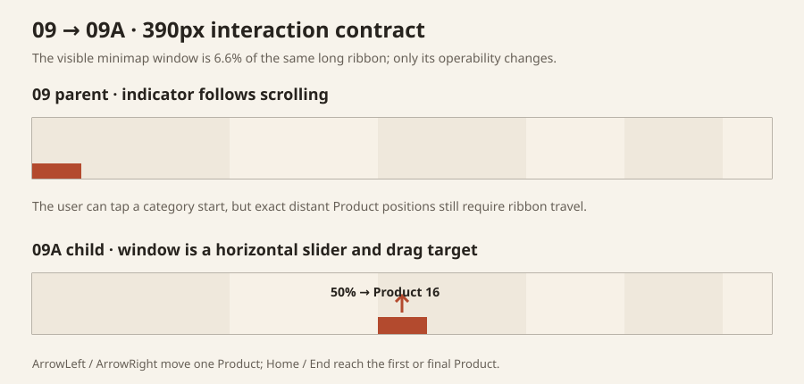
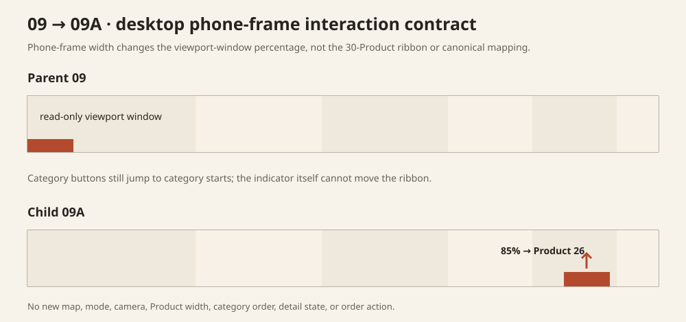

# 09A Direct Minimap Scrub implementation review

```text
Repository: a20030824/menu-lens
Branch: agent/menu-lens-09a-direct-minimap-scrub
Base main: 54bde49c6c1df800ba2e8d1b014c2a2b9eef9177
Parent: 09 Horizontal Ribbon
Child: 09A Direct Minimap Scrub
```

## Re-read finding

The existing product-owner review describes 09 as hard to use but playful enough to preserve. The prototype already contains several ways to move:

- drag the long ribbon;
- release into inertia and nearest-Product snap;
- use previous / next;
- use ArrowLeft / ArrowRight;
- select a category in the minimap;
- select a category header or Product tick from overview.

The missing operation is not another destination list. The minimap already shows the complete category proportions and current viewport window, but the viewport window is read-only. A user can see a distant location without directly moving the ribbon to that exact location.

## Unique variable

09A changes only the existing minimap viewport window from a read-only indicator into a direct position control.

```text
09 parent:
minimap category segments = clickable category starts
viewport window = read-only location indicator

09A child:
minimap category segments = unchanged
viewport window = draggable and keyboard-operable
```

Pointer position maps directly to the canonical 30-Product sequence:

```text
index = floor(clamp((pointerX - minimapLeft) / minimapWidth, 0, 1) × 30)
```

The final value is clamped to Product indices `0…29`.

## Why this remains one mechanism

09A does not add a second map, rail, page, mode, camera, compression rule, or navigation hierarchy. It makes the existing locator directly manipulable.

The Product sequence remains the same source of truth for:

- ribbon order;
- minimap category proportions;
- active Product count (`1 / 30` through `30 / 30`);
- previous / next;
- keyboard movement;
- direct scrub mapping.

## Parent behavior preserved

The child continues to load the exact parent:

- `horizontal-ribbon.css`;
- `horizontal-ribbon-renderer.js`;
- `spatial-drag.js`;
- shared six-category / 30-Product fixture.

Preserved geometry and interaction include:

- one 30-Product horizontal ribbon;
- Product width `11.6rem` in reading scale;
- category header width `3.15rem`;
- category widths proportional to Product count;
- exact overview geometry;
- category buttons in the minimap;
- category-header and Product-tick entry into reading;
- original ribbon pointer drag;
- original inertia;
- nearest-Product settle;
- previous / next;
- viewport ArrowLeft / ArrowRight;
- native Product details;
- Escape closes detail first, then returns to overview;
- reduced-motion behavior;
- canonical Product and category order.

## Direct scrub behavior

### Pointer and touch

- The existing accent viewport window accepts primary pointer drag.
- Its visible width remains the actual viewport fraction of the long ribbon.
- A pseudo-element expands the horizontal hit area to at least `2.75rem` without changing the visible geometry.
- Pointer movement is throttled through `requestAnimationFrame`.
- Overview scrub enters reading scale at the mapped Product.
- Reading-scale scrub moves immediately with `behavior: auto` so the direct control does not trail behind the pointer.

### Keyboard

The viewport window exposes `role="slider"` and reports:

- `aria-valuemin="1"`;
- `aria-valuemax="30"`;
- current Product position;
- current Product and category name in `aria-valuetext`.

Keys:

- ArrowLeft — previous Product;
- ArrowRight — next Product;
- Home — first Product;
- End — final Product.

The original viewport keyboard model remains available.

## Viewport evidence

The committed evidence files are geometry and interaction-contract captures rather than live browser screenshots. Parent and child use the same minimap proportions and ribbon geometry.

### 320px



### 390px



### Desktop phone frame



The viewport-window fraction changes with viewport width, but the direct mapping always uses the full minimap width and the same 30 Product indices.

## State assessment

| State | Result |
| --- | --- |
| overview | Same full 30-tick overview; the full-width viewport indicator can be dragged to enter reading at a direct Product position. |
| category jump | Existing six category buttons still move to each category's first Product. |
| direct scrub | Existing window maps pointer X to the canonical Product index. |
| local ribbon drag | Exact shared `spatial-drag.js`, inertia, and nearest-Product settle remain. |
| previous / next | Unchanged one-Product movement. |
| keyboard | Viewport arrows remain; minimap slider adds arrows plus Home / End on the existing locator. |
| detail open | Native detail behavior remains inside the active Product. |
| detail close | Escape closes the Product and restores focus to its summary. |
| reset | Second Escape returns to overview and focuses the overview control. |
| reduced motion | Parent smooth-scroll choice and minimap transition removal remain; direct scrub itself uses immediate mapping. |

## Expected benefit

09A separates two movement scales without creating another surface:

- ribbon drag for nearby Products and spatial continuity;
- minimap-window scrub for distant Products.

This removes the need to repeatedly swipe or click through most of the 30-Product ribbon when the desired area is already visible in the minimap.

## Remaining limitation

Direct access does not make the long ribbon shorter. After a distant jump, the user still sees only a local Product neighbourhood and must interpret its relationship to the complete sequence through the minimap.

The correct conclusion is therefore bounded:

- 09A may improve 09's navigation cost;
- it does not make 09 suitable as the primary menu screen;
- it does not justify another locator, Product compression, extra scale, or camera rescue.

## Files changed

```text
docs/research-history/09a-direct-minimap-scrub-review.md
package.json
research-history/direct-ribbon-scrub.css
research-history/direct-ribbon-scrub.js
research-history/index.html
research-history/phases/09a-direct-minimap-scrub/index.html
research-history/prototype-registry.js
research-history/review-assets/09a/*
scripts/validate-09a-direct-minimap-scrub.mjs
```

Shared runtime files changed: none.

Parent 09 HTML, CSS, renderer, shared fixture, and shared drag controller remain unchanged.

## Automated validation

The child-specific validator checks:

- registry lineage, path, profile, and exact assets;
- one minimap and no additional static buttons;
- slider semantics and keyboard contracts;
- canonical pointer mapping at left, midpoint, right, and out-of-bounds positions;
- all six categories and 30 unique Products from the parent renderer;
- parent `11.6rem` Product width, `3.15rem` category header, drag, inertia-settle path, and snap;
- child CSS does not alter ribbon, Product, category, viewport, typography, overflow, flex, or grid geometry;
- scrub helper delegates movement rather than implementing another camera;
- no Candidate, cart, order, or transaction behavior.

## Initial implementation judgment

**Directionally coherent.** The direct control addresses the central travel-cost complaint using the locator already present in 09. Final disposition should distinguish “useful research repair” from “suitable primary interface.” No second rescue mechanism will be added.