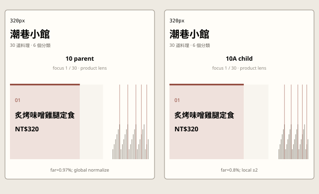
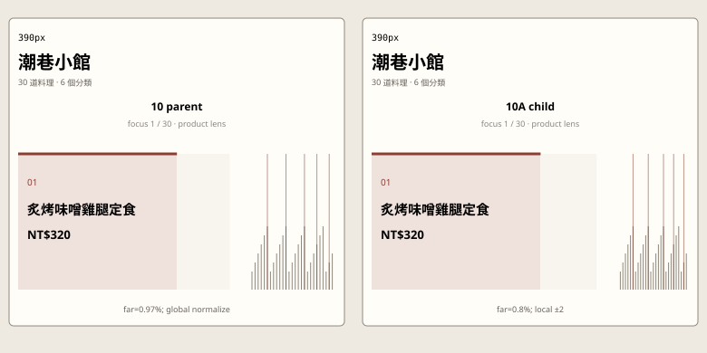
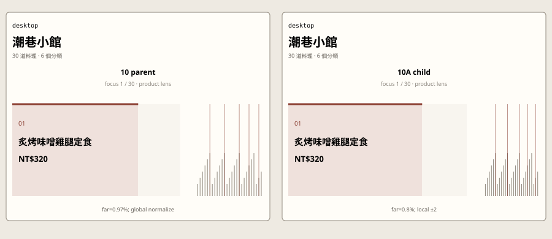

# 10A Local Fisheye implementation review

```text
Repository: a20030824/menu-lens
Branch: agent/menu-lens-10a-local-fisheye
Base main: 54bde49c6c1df800ba2e8d1b014c2a2b9eef9177
Parent: 10 Fisheye Ribbon
Child: 10A Local Fisheye
Continuation result: KEEP
```

## Unique variable

Only the product-lens deformation support changes.

- **10 parent:** every product receives a distance weight and the whole set is normalized by the weights that actually exist at the current focus index.
- **10A child:** every product outside `focus ± 2` remains fixed at `0.8%`; the remaining width is distributed only among the focus product and the neighbours that actually exist inside that radius.

Category lens, pointer mapping, keyboard previous/next, canonical sequence, product detail, category membership, and the one-viewport boundary are unchanged.

## Implementation discovery

The parent was already more local than its controller loop suggested. When the complete `±2` neighbourhood exists, the denominator is constant:

```text
18 + 6 + 6 + 2.5 + 2.5 + 25 × 0.35 = 43.75
```

This means an interior far product already receives exactly:

```text
0.35 / 43.75 = 0.8%
```

The genuine global drift occurs at the first and last two products, where missing neighbours reduce the denominator and enlarge every far product. 10A fixes that edge leakage rather than pretending that the entire parent was globally unstable.

## Parent / child measurements

| Focus position | Parent focus width | 10A focus width | Parent far width | 10A far width |
| --- | ---: | ---: | ---: | ---: |
| first product | 50.07% | 53.25% | 0.97% | 0.80% |
| second product | 43.27% | 43.86% | 0.86% | 0.80% |
| interior product | 41.14% | 41.14% | 0.80% | 0.80% |
| final product | 50.07% | 53.25% | 0.97% | 0.80% |

For focus `1 → 2`, the parent moves the first far category boundary by about `2.91 percentage points`; 10A keeps all category boundaries outside the local neighbourhood fixed. For focus `2 → 3`, the parent still moves that boundary by about `0.91 points`; 10A again keeps it fixed. Interior focus movement was already stable outside the local neighbourhood in the parent and remains so in 10A.

## Viewport comparison

These are automated geometry captures at the required viewports. They render the parent and child allocation equations with the same 30-product, six-category ribbon structure. The execution environment blocked Chromium navigation to both GitHub Pages and localhost, so the review used `page.setContent` rather than claiming a live deployed-page capture.

### 320px

Left is parent 10; right is 10A.



### 390px

Left is parent 10; right is 10A.



### Desktop

Left is parent 10; right is 10A.



The width equation is viewport-independent: the first and final focus remain `53.25%`, interior focus remains `41.14%`, and every far product remains `0.80%` at all three widths. The smaller viewports therefore reduce absolute pixels but do not change the parent/child relationship or introduce a breakpoint-specific geometry.

## State review

| State | Result |
| --- | --- |
| initial | Category lens is inherited unchanged from 10. |
| focus | Product lens applies the fixed far width and radius-two local allocation. |
| cross-category | The crossed category boundary may move because it is inside the local neighbourhood; unrelated boundaries remain fixed. |
| rapid focus changes | No accumulated scroll, inertia, camera pan, or snap state is introduced. |
| detail open | Same native `details` behavior and same focused product allocation as 10. |
| detail close | Escape closes detail and restores focus to the same summary, as in 10. |
| reset | Category-lens button restores the unchanged parent category lens. |
| touch / pointer | Same seven-pixel axis lock and direct pointer-X mapping as 10. |
| keyboard | ArrowLeft / ArrowRight keep the original stage behavior; when a product summary owns focus, DOM focus now follows the newly focused summary instead of remaining on the old product. |
| reduced motion | Parent flex transition is still disabled; 10A adds no new motion. |

## Narrow continuation revision

```text
Remaining problem:
Arrow navigation from a focused product summary moved the visual lens but left DOM focus on the previous summary.

Single revision:
After product-lens ArrowLeft / ArrowRight, move DOM focus to the newly focused summary only when the key event originated from a summary.

Why this is not a second mechanism:
No geometry, weight, pointer mapping, lens state, category order, detail behavior, or transition grammar changed.

Files affected:
research-history/local-fisheye.js
scripts/validate-local-fisheye.mjs

Expected result:
Keyboard users can continue with Enter from the new visual focus without snapping the lens back to the previous product.
```

One narrow revision was made. No further rescue changes are proposed in this PR.

## Files changed

```text
research-history/phases/10a-local-fisheye/index.html
research-history/local-fisheye.css
research-history/local-fisheye.js
research-history/prototype-registry.js
research-history/index.html
scripts/validate-local-fisheye.mjs
package.json
docs/research-history/10a-local-fisheye-review.md
research-history/review-assets/10a/*.svg
```

Shared files touched:

- `research-history/prototype-registry.js`
- `research-history/index.html`
- `package.json`

The parent HTML, CSS, renderer, gesture model, and shared 30-product fixture are not modified.

## Automated validation

The child validator checks:

- registered parent, family, path, assets, and profile;
- one positive finite width for all 30 products;
- total allocation remains exactly 100%;
- all products outside radius two retain the same far width;
- focus remains the largest readable allocation;
- category boundaries outside the local neighbourhood do not move across representative start, middle, and end transitions;
- product-summary arrow navigation keeps DOM focus aligned with the visual focus;
- no horizontal scroll, spatial-drag, or snap mechanism is introduced;
- no order action appears.

GitHub Actions run 34 passed:

```text
npm run typecheck — passed
npm test          — passed
npm run build     — passed
```

## Final decision

**KEEP — bounded success, not a general victory over the parent.**

10A successfully stops edge focus from enlarging every distant product and stabilizes far category boundaries at the beginning and end. It does not improve interior focus movement because parent 10 already had fixed far widths there. The first and final focus cards become slightly larger because the conserved remaining width stays inside the local neighbourhood; they still retain the same focused-card typography and detail behavior as parent 10.

This remains recognizably fisheye: focus is largest, first and second neighbours step down, all 30 products remain visible, and no tabs, fixed category columns, scrolling ribbon, camera, or extra endpoints are introduced.

## Deliberately unresolved

- Direct live-device perception of the larger edge focus remains useful review evidence, but it is not required to establish the geometry improvement.
- Product names on far ticks remain unreadable by design.
- Category lens still uses the parent category-wide allocation; 10A does not mix a second variable into that state.
- No 10B or 10C work has started.
- No second navigation system will be added to 10A.
