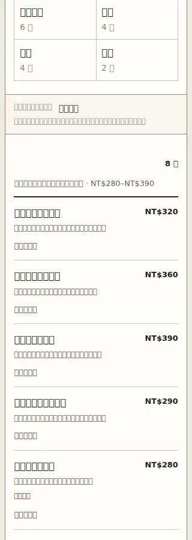
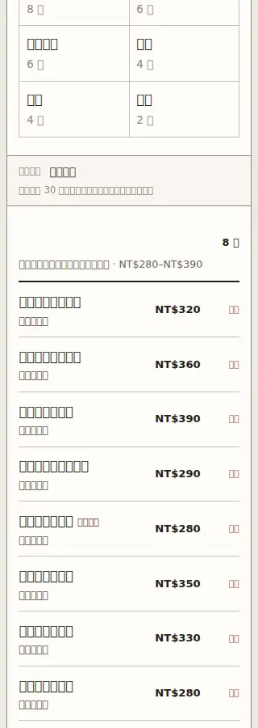
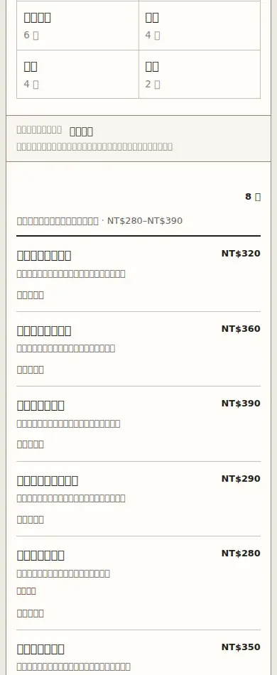
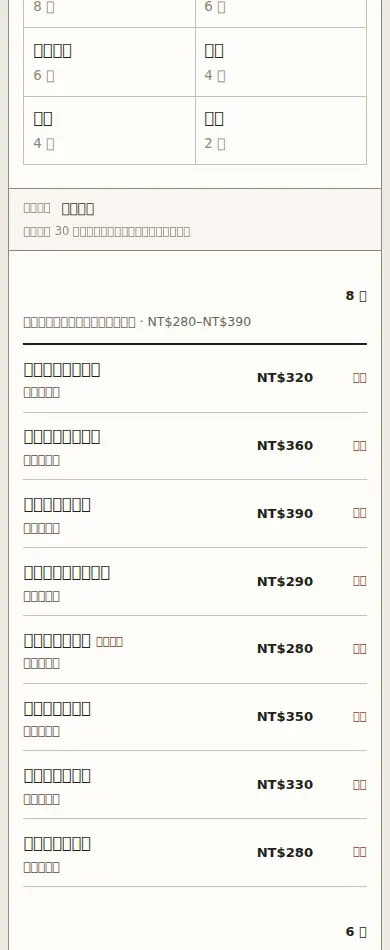
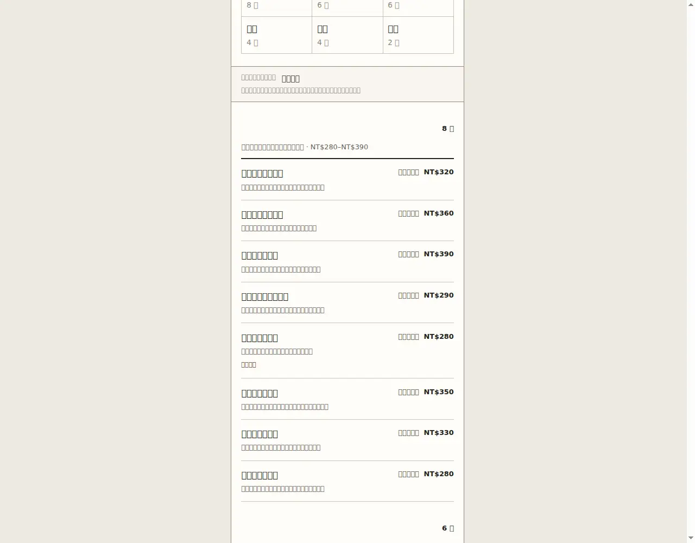
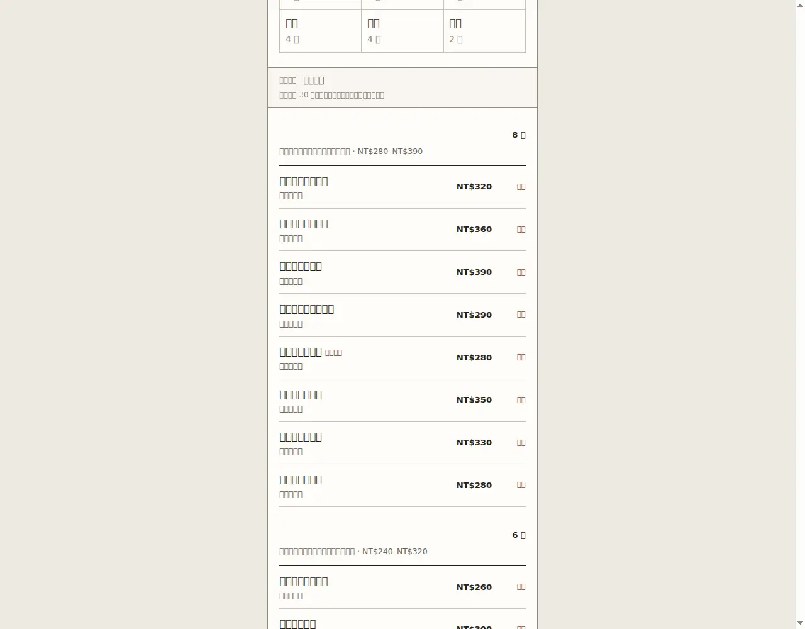
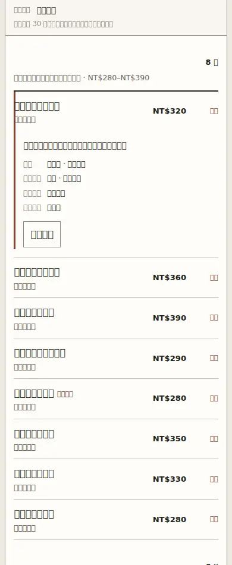

# 05A Minimal Ledger Row — implementation review

```text
Repository: a20030824/menu-lens
Base branch: main
Base commit: 54bde49c6c1df800ba2e8d1b014c2a2b9eef9177
Parent: 05 Ledger Document
Child: 05A Minimal Ledger Row
```

## Unique variable

05A changes only the information visible in a **collapsed Product row**.

```text
05 parent collapsed row
name + full description + cue + price + status

05A collapsed row
name + one short cue + price + necessary status + disclosure
```

The complete description, portion, preparation rhythm, required configuration, availability and evidence labels remain available in the inline detail.

## Parent behavior retained

- one complete vertical document;
- all six categories and 30 unique Products;
- canonical Category and Product order;
- categories never filter, sort or collapse;
- ledger rows with repeated cue and price positions;
- inline detail beneath the source row;
- at most one detail open;
- pointer and keyboard operation;
- detail close returns focus and reading position;
- no Candidate, comparison, cart, order or transaction flow.

## Parent / child screenshots

| Viewport | 05 parent | 05A child |
|---|---|---|
| 320px |  |  |
| 390px |  |  |
| desktop |  |  |

Inline detail at 390px:



## Actual browser checks

The parent and child were run from the same local static server in Chromium. Device metrics were set through the Chrome DevTools Protocol.

| Check | 320px | 390px | desktop |
|---|---:|---:|---:|
| Categories | 6 | 6 | 6 |
| Products | 30 | 30 | 30 |
| Unique ProductIds | 30 | 30 | 30 |
| Horizontal overflow | no | no | no |
| First-category price right edge | 249px for all 8 rows | 313px for all 8 rows | 775px for all 8 rows |
| Sold-out row within viewport width | yes | yes | yes |

Collapsed DOM order is identical at every viewport:

```text
name → cue → price → detail control
```

Interaction checks:

```text
pointer/touch open                  pass
pointer close                       pass
pointer focus return                pass
Enter opens detail                 pass
keyboard open focuses close        pass
Escape closes detail               pass
keyboard focus return              pass
opening second detail closes first pass
reload/reset returns to zero open  pass
reduced-motion media query         pass
reduced-motion transition time     0s
```

Machine-readable results are preserved in `browser-checks.json`.

## Changed files

Child-specific implementation:

```text
research-history/phases/05a-minimal-ledger/index.html
research-history/minimal-ledger.css
research-history/minimal-ledger.js
scripts/validate-minimal-ledger.mjs
```

Research integration and evidence:

```text
research-history/prototype-registry.js
research-history/index.html
package.json
.github/workflows/05a-validation.yml
docs/research-history/reviews/05a/*
```

## Shared-file contact

05A does **not** modify the parent 05 HTML, `history.css`, `evidence.css`, the fixture, or any shared renderer.

It touches three coordination files only:

- `prototype-registry.js` to register 05A as a document-family child of 05;
- `research-history/index.html` to expose the executable child and direct comparison row;
- `package.json` to add the child-specific validator to formal `test` and `build` commands.

## Actual judgment

```text
Implementation result: PASS
Product-direction result: PROVISIONAL, not accepted
```

05A passes its implementation gate. At 320px and 390px it makes the price axis stable, places substantially more menu rows in the same viewport, keeps the longest Product name readable, preserves one meaningful cue and restores all removed information through inline detail. It still reads as a composed menu rather than a name-price index.

This does not establish participant comprehension or superiority over 05. A direct unfamiliar-reader task is still required before changing either prototype's status.

## Deliberately unresolved

- whether the shorter rows improve actual Product comparison rather than only visible density;
- whether one cue is sufficient for every restaurant fixture;
- the long-document travel cost inherited from 05;
- cross-category comparison;
- category-map return behavior;
- whether the repeated `詳情` disclosure is the best final wording.

If future review finds that 05A only succeeds after removing the remaining cue or turning rows into name-price records, stop this branch rather than converting the ledger into a generic index or card list.
