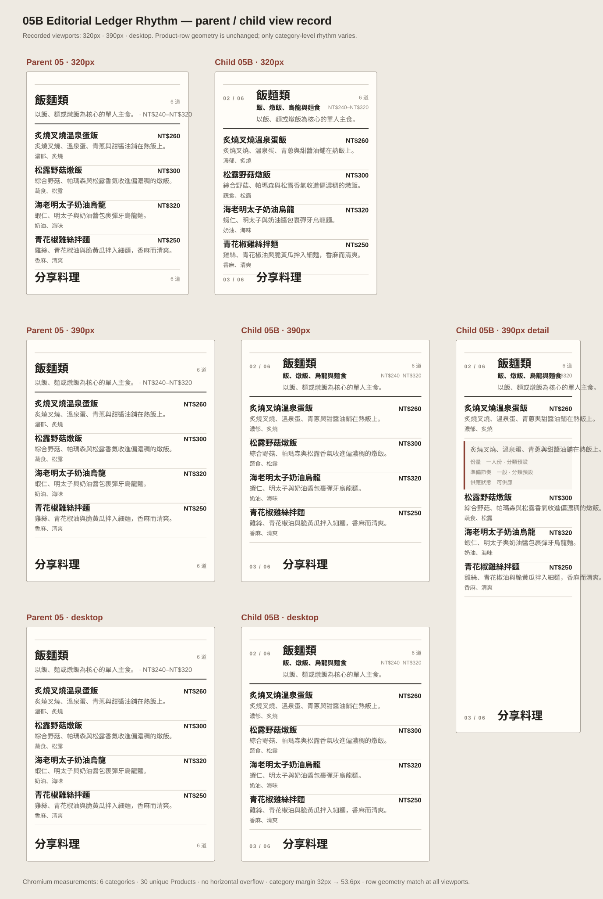

# 05B Editorial Ledger Rhythm — implementation review

```text
Repository: a20030824/menu-lens
Base branch: main
Base commit: 54bde49c6c1df800ba2e8d1b014c2a2b9eef9177
Parent: 05 Ledger Document
Child: 05B Editorial Ledger Rhythm
```

## Unique variable

05B changes only the **category-level editorial rhythm**. Every category gains a stronger chapter opener using fixture-backed category sequence, summary, count, price range and description.

Product rows remain the 05 parent rows:

```text
name + complete description + cue + price + necessary sold-out state
```

Inline detail and single-open behavior remain unchanged.

## Preserved parent behavior

- one complete vertical document;
- all six categories and 30 unique Products;
- canonical Category and Product order;
- original 05 Product row content and grid classes;
- shared cue and price columns;
- inline detail beneath the source row;
- one detail open at a time;
- category navigation only scrolls to existing content;
- no Candidate, comparison, cart, order or transaction flow.

## Parent / child screenshots

The following WebP combines the actual Chromium captures at 320px, 390px and desktop, plus the 390px child detail state.


## Annotated view record



Machine-readable viewport and interaction results are stored separately in `browser-checks.json`.

## Evaluation boundary

Success requires clearer category breaks at 320px and 390px while Product row geometry remains equal to 05. If the only way to create rhythm is to select a featured dish, hide products, add cards or alter row information, 05B fails rather than expanding scope.

## Evidence method

Chromium was used to capture and measure the same 05 Product-row markup and CSS in parent and child states. `parent-child-screenshots.webp` preserves the actual browser captures; the SVG contact sheet adds labels and measured-state annotation; `browser-checks.json` preserves viewport, geometry and interaction results. The repository validator separately verifies the child renderer against the canonical shared fixture: six categories, 30 unique ProductIds, canonical order, complete descriptions, cues, prices and availability states.

## Archive coordination

This Draft PR intentionally leaves the shared prototype registry and archive index untouched while parallel Workstreams remain open. The executable child path and its formal validator are complete; catalog insertion can be rebased as a bounded coordination change after the earlier Draft PR lands.

## Actual judgment

```text
Implementation result: PASS
Product-direction result: PROVISIONAL
```

05B creates a visibly stronger pause at category boundaries without changing Product-row geometry. The cost is additional vertical distance between categories. Direct reading review is still required to decide whether the stronger chapter rhythm is worth that added length.
