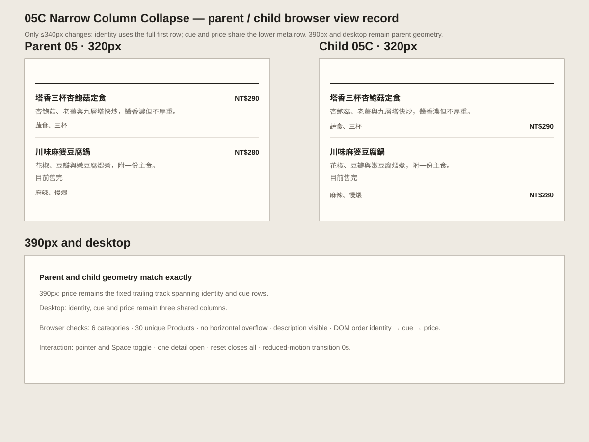

# 05C Narrow Column Collapse — implementation review

```text
Repository: a20030824/menu-lens
Base branch: main
Base commit: 54bde49c6c1df800ba2e8d1b014c2a2b9eef9177
Parent: 05 Ledger Document
Child: 05C Narrow Column Collapse
```

## Unique variable

05C changes only the **≤340px cue / price collapse grammar**.

```text
05 parent at 320px
identity | price spanning two rows
cue     |

05C at 320px
identity across full first row
cue | price on one lower meta row
```

390px and desktop remain the parent 05 geometry. Description, sold-out state, category hierarchy, Product order and inline detail remain unchanged.

## View record



Machine-readable browser measurements are in `browser-checks.json`.

## Preserved behavior

- one complete vertical document;
- six categories and 30 unique Products;
- canonical Category and Product order;
- complete description remains visible in the collapsed row;
- cue, price and necessary sold-out state remain visible;
- inline detail remains beneath the source row;
- one detail open at a time;
- no category collapse, editorial feature, card, filter or sort;
- no Candidate, comparison, cart, order or transaction flow.

## Browser result

At 320px, identity width increases from 227.16px to 284px while the price right edge remains 302px. Cue and price share the same lower baseline and horizontal overflow remains false.

At 390px and desktop, parent and child identity, cue and price rectangles match exactly.

Pointer, keyboard Space, single-open detail, reset and reduced-motion checks pass.

## Formal validation

```text
npm run typecheck  ✓
npm test           ✓
npm run build      ✓
```

## Archive coordination

This parallel Draft PR leaves `prototype-registry.js` and the archive index untouched to avoid catalog conflicts with 05A and 05B. The executable child and formal validator are complete; registry insertion remains a bounded coordination change after the earlier Draft PRs land.

## Actual judgment

```text
Implementation result: PASS
Product-direction result: PROVISIONAL
```

05C removes the narrowest-screen competition between a long identity block and a vertically spanning price without changing the information model. It does not prove that the lower price position improves scanning for unfamiliar readers, so direct 05 / 05C review remains required.
