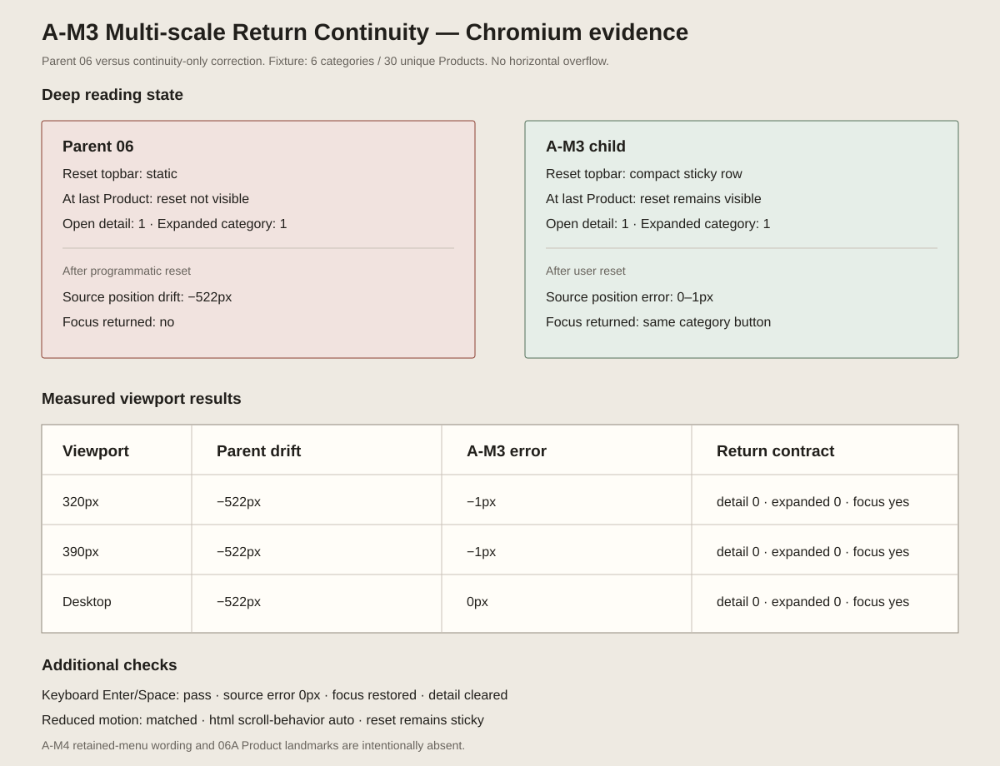

# A-M3 Multi-scale Return Continuity — implementation review

```text
Repository: a20030824/menu-lens
Base branch: main
Base commit: 54bde49c6c1df800ba2e8d1b014c2a2b9eef9177
Prototype: 06 Multi-scale Menu Map
Change type: M
```

## Unique variable

A-M3 changes only **focus-to-overview return continuity**.

Before expanding a category, the controller records the source category button and its viewport position. Reset then:

1. closes any open Product detail;
2. collapses the focused category;
3. waits for the collapsed layout to settle;
4. restores the same category button to its previous viewport position;
5. returns keyboard focus to that button.

While a category is expanded, the existing topbar becomes one compact sticky row so the reset action remains reachable during deep reading.

## Layout correction

A later direct viewport audit found that the first evidence checked only computed `position: sticky`. The row was actually outside the viewport because the shared `.phone-frame { overflow: hidden; }` established the wrong sticky containment boundary.

The narrow repair:

- overrides the 06 frame with `overflow: clip`, preserving clipping without creating a scroll container;
- keeps the full accessible button name `回到全店概覽`;
- shortens only the visible button copy to `回全店`;
- keeps the focused row below 48px without changing the controller or return calculation.

No category geometry, Product content, collapse amount, source-position restoration, or focus behavior changed.

## View evidence



Machine-readable Chromium measurements:

- `browser-checks.json` — original parent/child continuity comparison;
- `layout-checks.json` — direct initial, focused, deep, and returned viewport geometry.

## Preserved behavior

- one category expanded at a time;
- five neighboring categories remain collapsed in canonical positions;
- six categories and 30 unique Products;
- category count, range and summary payload unchanged;
- Product rows and inline detail unchanged;
- existing scale labels unchanged;
- no retained-menu truth copy from A-M4;
- no Product landmarks from 06A;
- no Candidate, comparison, cart, order or transaction flow.

## Final browser result

Across 320px, 390px and desktop:

- focused topbar viewport top: `0px`;
- deep-reading topbar viewport top: `0px`;
- focused and deep topbar height: about `46.95px`;
- reset action visible in focused and deep states;
- source-position error after reset: `0px`;
- open Product detail after reset: `0`;
- expanded categories after reset: `0`;
- focus returns to the original category button;
- no document, frame, screen, topbar, label, or reset horizontal overflow;
- no page errors;
- reduced motion uses immediate scrolling.

Keyboard Enter/Space follows the same return contract.

## Archive coordination

This is a mechanism correction to prototype 06, not a registry child. `prototype-registry.js`, the archive index, `menu-fixture.js`, `multiscale-menu-renderer.js`, `history.css` and `evidence.css` remain untouched.

A-M4 retained-menu truth wording and 06A Product-bearing Landmarks remain separate later changes.

## Actual judgment

```text
Implementation result: PASS after narrow layout repair
Product-direction result: PASS as prerequisite correction
```

A-M3 now makes the existing scale transition both reversible and physically reachable without changing the multiscale information model. It resolves only the continuity prerequisite; filter trust and landmark quality remain separate questions.
